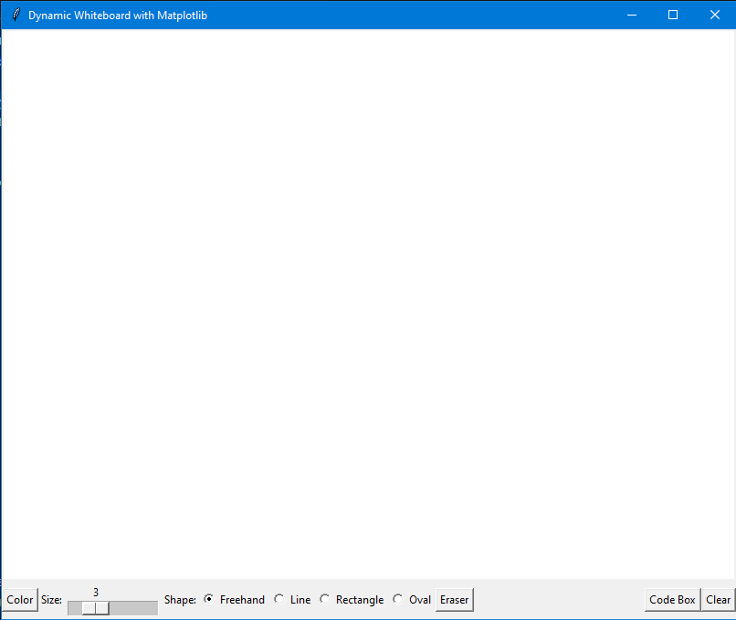
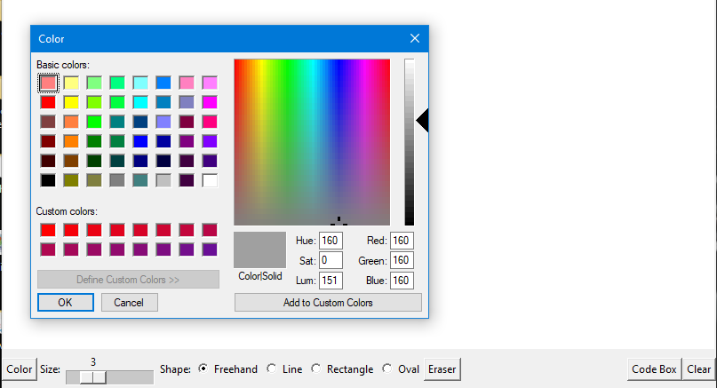
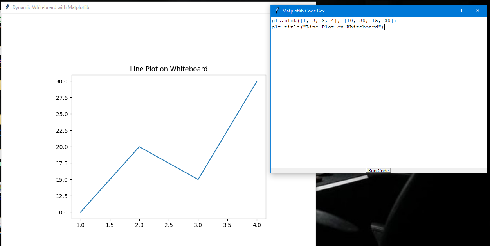
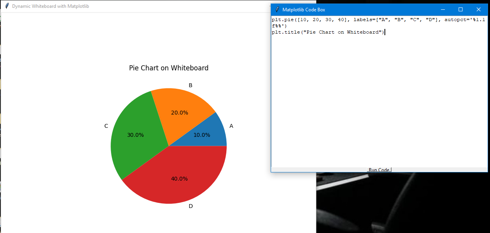

# 🎨 Dynamic Whiteboard & Visualization Studio


## 🚀 Overview

Dynamic Whiteboard & Visualization Studio is an interactive desktop application built using Python that combines digital drawing tools with real-time data visualization.

Users can draw freely on a virtual whiteboard and generate dynamic charts using an integrated Python code execution environment powered by Matplotlib.

This project demonstrates GUI Development, Data Visualization, Event-Driven Programming, and Interactive Software Design.

---

## ✨ Features

### 🖌️ Interactive Whiteboard
- Freehand drawing support
- Adjustable brush size
- Multiple color selection options
- Smooth drawing experience

### 📐 Shape Drawing Tools
- Line Tool
- Rectangle Tool
- Oval/Circle Tool

### 🎨 Customization Options
- Color Picker
- Brush Size Control
- Eraser Tool

### 🧹 Canvas Management
- Clear Canvas Functionality
- Drawing Reset Option

### 💻 Integrated Code Editor
- Write Python visualization code
- Execute Matplotlib commands directly
- Generate graphs instantly

### 📊 Real-Time Visualization

Supports:

- Line Charts
- Scatter Plots
- Bar Charts
- Histograms
- Pie Charts

---

## 🛠️ Technology Stack

### Programming Language
- Python

### GUI Framework
- Tkinter

### Visualization
- Matplotlib

### Image Processing
- Pillow (PIL)

---

## 📂 Project Structure

```text
Dynamic-Whiteboard-Python/
│
├── screenshots/
│   ├── features.png
│   ├── line_plot.png
│   ├── pie_chart.png
│   └── whiteboard.png
│
├── main.py
├── requirements.txt
└── README.md
```

---

## 🚀 Installation

### Clone the Repository

```bash
git clone https://github.com/your-username/Dynamic-Whiteboard-Python.git
```

### Navigate to the Project Folder

```bash
cd Dynamic-Whiteboard-Python
```

### Install Dependencies

```bash
pip install -r requirements.txt
```

---

## ▶️ Run the Application

```bash
python main.py
```

---

## 📸 Screenshots

### Whiteboard Interface



### Features Overview



### Line Plot Visualization



### Pie Chart Visualization



---

## 📊 Example Visualization Code

### Line Plot

```python
plt.plot([1, 2, 3, 4], [10, 20, 15, 30])
plt.title("Line Plot on Whiteboard")
```

### Scatter Plot

```python
plt.scatter([1, 2, 3, 4], [10, 20, 15, 30])
plt.title("Scatter Plot on Whiteboard")
```

### Bar Plot

```python
plt.bar([1, 2, 3, 4], [10, 20, 15, 30])
plt.title("Bar Plot on Whiteboard")
```

### Histogram

```python
plt.hist([1, 2, 2, 3, 4, 5, 6], bins=5)
plt.title("Histogram on Whiteboard")
```

### Pie Chart

```python
plt.pie(
    [10, 20, 30, 40],
    labels=["A", "B", "C", "D"],
    autopct="%1.1f%%"
)
plt.title("Pie Chart on Whiteboard")
```

---

## 🎓 Learning Outcomes

Through this project, I gained practical experience in:

- GUI Development using Tkinter
- Event Handling in Python
- Interactive Drawing Applications
- Data Visualization using Matplotlib
- Dynamic Code Execution
- Software Design Principles
- User Interface Development

---

## 🌟 Skills Demonstrated

- Python Programming
- Tkinter GUI Development
- Matplotlib Visualization
- Event-Driven Programming
- Object-Oriented Programming
- Interactive Application Development

---

## 🔮 Future Enhancements

- Save Whiteboard as Image
- Export Charts
- Multiple Canvas Tabs
- Undo/Redo Functionality
- Dark Mode Support
- Collaborative Whiteboard Features
- Cloud Storage Integration
- AI-Assisted Visualization Suggestions

---

## 👩‍💻 Author

**Mahima Mishra**

BCA Student | Aspiring Software Engineer | Python & AI Enthusiast

---

## ⭐ Project Status

✅ Completed

✅ Interactive Whiteboard Implemented

✅ Dynamic Visualization Integrated

✅ Multiple Graph Types Supported

✅ Portfolio Ready

---

## 📄 License

This project is licensed under the MIT License.

---

## 🌟 Support

If you found this project useful, consider giving it a ⭐ Star on GitHub.
